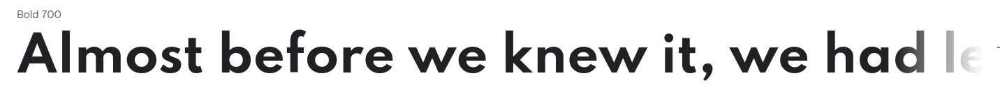
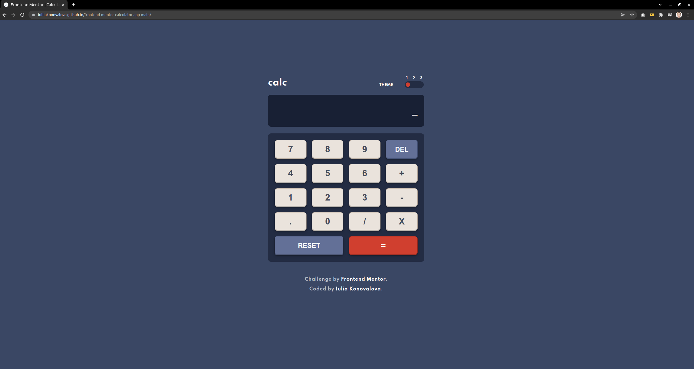
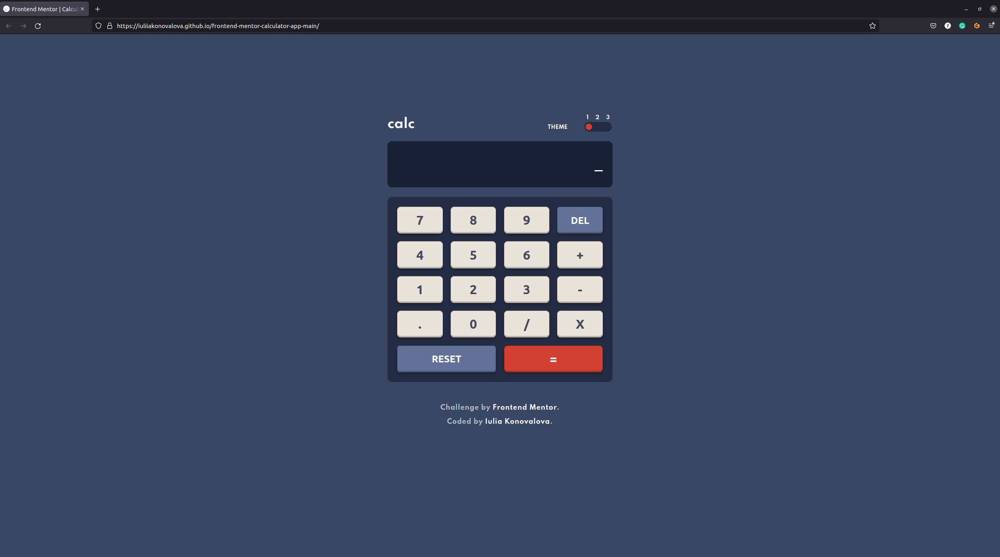
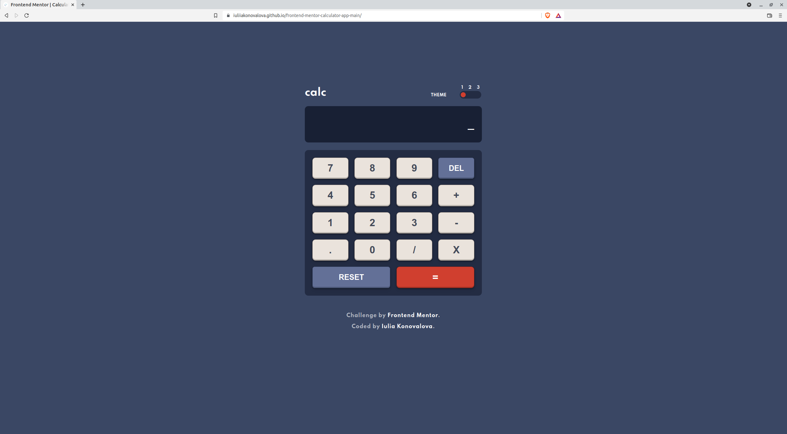
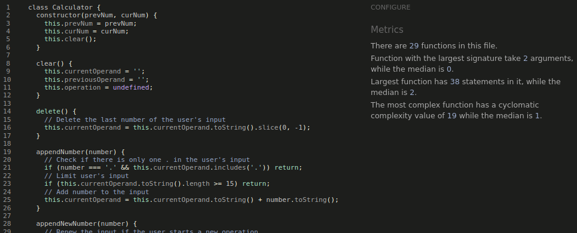
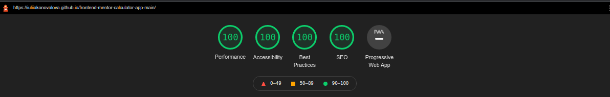

# Frontend Mentor - Calculator app


The project was based on the challenge provided by [Frontend Mentor](https://www.frontendmentor.io).


This is a solution to the [Calculator app](https://www.frontendmentor.io/challenges/calculator-app-9lteq5N29/hub/calculator-app-Jwe-D6TTH). 

## The design provided


I was using design files provided for this challenge in order to make the result look as similar as possible to the provided images.

I have also added various breakpoints in order to provide the best user experience.

The solution to this challenge can be accessed by this [link](https://iuliiakonovalova.github.io/frontend-mentor-calculator-app-main/)


---
## Table of contents

- [User Stories](#user-stories)
- [Features](#features)
- [Technologies Used](#technologies-used)
- [Design](#design)
- [Bugs](#bugs)
- [Testing](#testing)
  - [Compatibility](#compatibility)
  - [Validator testing](#validator-testing)
  - [Lighthouse Report](#lighthouse-report)
- [Deployment](#deployment)
- [Author](#author)
- [Credits](#credits)
- [Acknowledgments](#acknowledgments)

---
## User Stories

### First Time Visitor Goals:

* As a First Time Visitor, I want to easily understand the main purpose of the app, so I can learn more about this app.
* As a First Time Visitor, I want to be able to easily navigate through the app, so I can find the content.
* As a First Time Visitor, I want to find the app useful.

### Frequent Visitor Goals:
* As a Frequent User, I want to be able always access the app, so I can count the make calculations when I need.
* As a Frequent User, I want to have different themes, so I can adjust the view according to the light around my device.
* As a Frequent User, I want calculations to be always correct, so I can rely on the app completely.
* As a Frequent User, I want the app be flexible in size, so I can use this app on different devices.

---

## Features


---

## Technologies Used

- [HTML](https://developer.mozilla.org/en-US/docs/Web/HTML) - was used as the foundation of the site.
- [CSS](https://developer.mozilla.org/en-US/docs/Web/css) - was used to add the styles and layout of the site.
- [CSS Flexbox](https://developer.mozilla.org/en-US/docs/Learn/CSS/CSS_layout/Flexbox) - was used to arrange items symmetrically on the pages.
- [CSS Grid](https://developer.mozilla.org/en-US/docs/Web/CSS/grid) - was used to make "gallery" and "contact" pages responsive.
- [CSS roots](https://developer.mozilla.org/en-US/docs/Web/CSS/:root) - was used to declaring global CSS variables and apply them throughout the project. 
- [JS](https://www.javascript.com/) - was used to make calculations and display content on the page.
- [JavaScript HTML DOM](https://www.w3schools.com/js/js_htmldom.asp) - was used to access and manipulate elements in html file.
- [VSCode](https://code.visualstudio.com/) - was used as the main tool to write and edit code.
- [Git](https://git-scm.com/) - was used for the version control of the website.
- [GitHub](https://github.com/) - was used to host the code of the website.
- [GIMP](https://www.gimp.org/) - was used to make and resize images for the README file.

---
## Design

- The color scheme was provided by [Frontend Mentor](https://www.frontendmentor.io).

- The font-families were chosen by [Frontend Mentor](https://www.frontendmentor.io) from Google Font website.

- Family: [Spartan](https://fonts.google.com/specimen/Spartan)
- Weights: 700




---
## Bugs
+ **Solved bugs**

1. The keydown event didn't work properly when the user clicked keys on the keyboard. The computation was failing since numbers were sum as a JS string

    - *Solutions:* value was changed to string.
    
    ```javascript
    if (event.key === '3') {
      calculator.appendNumber('3')
      calculator.updateDisplay()
    };
    ```

1. After hitting '=' key on the screen and 'Enter' on the keyboard, the user could add numbers to the result of the computation, rather than start a new operation

    - *Solutions:* Add function to ```class Calculator```.
    
    ```javascript
    appendNewNumber(number) {
      // Renew the input if the user starts a new operation
      this.currentOperand = ""
      this.currentOperand += number.toString()
    }
    ```
---
## Testing

### Compatibility:

+ The app was tested on the following browsers: Chrome, Firefox, Brave, Edge:

  - Chrome:

  
  
  - Firefox:

  

  - Brave:

  


  ---
### Validator testing
+ #### HTML
  
  - No errors or warnings were found when passing through the official [W3C](https://validator.w3.org/) validator.
  
    - Main Page:
  
    [Main Page HTML Validator](https://validator.w3.org/nu/?doc=https%3A%2F%2Fiuliiakonovalova.github.io%2Ffrontend-mentor-calculator-app-main%2F)
+ #### CSS
  
  - No errors or warnings were found when passing through the official [W3C (Jigsaw)](https://jigsaw.w3.org/css-validator/#validate_by_uri) validator: 

  [CSS Validator Errors](https://jigsaw.w3.org/css-validator/validator?uri=https%3A%2F%2Fiuliiakonovalova.github.io%2Ffrontend-mentor-calculator-app-main%2F&profile=css3svg&usermedium=all&warning=1&vextwarning=&lang=en)


+ #### JS

No errors or warnings were found when passing through the official [JSHint](https://jshint.com/) validator:

  

  ### Lighthouse Report



---
## Deployment

- The site was deployed to GitHub pages. The steps to deploy are as follows: 
  - In the [GitHub repository](https://github.com/IuliiaKonovalova/frontend-mentor-calculator-app-main/), navigate to the Settings tab 
  - From the source section drop-down menu, select the **Main** Branch, then click "Save".
  - The page will be automatically refreshed with a detailed ribbon display to indicate the successful deployment.

The live link can be found [here](https://iuliiakonovalova.github.io/frontend-mentor-calculator-app-main/)

---
### Local Deployment

In order to make a local copy of this project, you can clone it.
In your IDE Terminal, type the following command to clone my repository:

- `git clone https://github.com/IuliiaKonovalova/frontend-mentor-calculator-app-main.git`

---