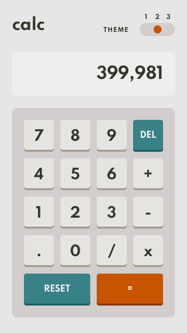

# Frontend Mentor - Calculator app


The project was based on the challenge provided by [Frontend Mentor](https://www.frontendmentor.io).


This is a solution to the [Calculator app](https://www.frontendmentor.io/challenges/calculator-app-9lteq5N29/hub/calculator-app-Jwe-D6TTH). 

## The design provided


I was using design files provided for this challenge in order to make the result look as similar as possible to the provided images.

I have also added various breakpoints in order to provide the best user experience.

The solution to this challenge can be accessed by this [link](https://iuliiakonovalova.github.io/frontend-mentor-calculator-app-main/)


---
## Table of contents

- [User Stories](#user-stories)
- [Features](#features)
- [Technologies Used](#technologies-used)
- [Design](#design)
- [Bugs](#bugs)
- [Testing](#testing)
  - [Compatibility](#compatibility)
  - [Validator testing](#validator-testing)
  - [Lighthouse Report](#lighthouse-report)
- [Deployment](#deployment)
- [Author](#author)
- [Credits](#credits)
- [Acknowledgments](#acknowledgments)

---
## User Stories

### First Time Visitor Goals:

* As a First Time Visitor, I want to easily understand the main purpose of the app, so I can learn more about this app.
* As a First Time Visitor, I want to be able to easily navigate through the app, so I can find the content.
* As a First Time Visitor, I want to find the app useful.

### Frequent Visitor Goals:
* As a Frequent User, I want to be able always access the app, so I can count the make calculations when I need.
* As a Frequent User, I want to have different themes, so I can adjust the view according to the light around my device.
* As a Frequent User, I want calculations to be always correct, so I can rely on the app completely.
* As a Frequent User, I want the app be flexible in size, so I can use this app on different devices.

---

## Features

+ ### Main Page

    - Represent: 

        * the calculator app.
        

    - Consist Logo and toggle:

        

        * Logo of the app on the left side.

        

        * Theme toggle allows user to pick preferable calculator's theme from 1 to 3.

            When the user click on the numbers of theme toggle, the theme would change immediately.

          1. Theme 1

              

          1. Theme 2

              

          1. Theme 3

              

    - Consist the calculator
    
    

    Including:

    - Calculator display where the user can see the operations:

    

    

    - Keyboard: 

        

        Which includes following keys: **0-9**, **X(*)**, **+**, **-**, **/**, **Delete**, **Reset**, **=**.
        User can use keys on the screen, as well as the stationary keyboard.

        *Notice*:
        - If the user wants to use '=' on the stationary keyboard, he/she needs to click 'Enter';
        - If the user wants to use 'DEL' on the stationary keyboard, he/she needs to click 'Backspace';
        - If the user wants to use 'RESET' on the stationary keyboard, he/she needs to click 'Esc';
        - If the user wants to add operation to the computation, the previous result (with which user wants to make another operation with) will be seen on the top of the screen.
        - If the user wants to make a new operation with new numbers after computing previously, the new numbers will be add automatically without the need to click 'RESET' or 'DEL'.

    * It the end of the page the user can find the credits section with links to the company's website, which created the challenge and the github of the coder of this web app

    
---

## Technologies Used

- [HTML](https://developer.mozilla.org/en-US/docs/Web/HTML) - was used as the foundation of the site.
- [CSS](https://developer.mozilla.org/en-US/docs/Web/css) - was used to add the styles and layout of the site.
- [CSS Flexbox](https://developer.mozilla.org/en-US/docs/Learn/CSS/CSS_layout/Flexbox) - was used to arrange items symmetrically on the pages.
- [CSS Grid](https://developer.mozilla.org/en-US/docs/Web/CSS/grid) - was used to make "gallery" and "contact" pages responsive.
- [CSS roots](https://developer.mozilla.org/en-US/docs/Web/CSS/:root) - was used to declaring global CSS variables and apply them throughout the project. 
- [JS](https://www.javascript.com/) - was used to make calculations and display content on the page.
- [JavaScript HTML DOM](https://www.w3schools.com/js/js_htmldom.asp) - was used to access and manipulate elements in html file.
- [VSCode](https://code.visualstudio.com/) - was used as the main tool to write and edit code.
- [Git](https://git-scm.com/) - was used for the version control of the website.
- [GitHub](https://github.com/) - was used to host the code of the website.
- [GIMP](https://www.gimp.org/) - was used to make and resize images for the README file.

---
## Design

- The color scheme was provided by [Frontend Mentor](https://www.frontendmentor.io).

- The font-families were chosen by [Frontend Mentor](https://www.frontendmentor.io) from Google Font website.

- Family: [Spartan](https://fonts.google.com/specimen/Spartan)
- Weights: 700


---
## Bugs
+ **Solved bugs**

1. The keydown event didn't work properly when the user clicked keys on the keyboard. The computation was failing since numbers were sum as a JS string

    - *Solutions:* value was changed to string.
    
    ```javascript
    if (event.key === '3') {
      calculator.appendNumber('3')
      calculator.updateDisplay()
    };
    ```

1. After hitting '=' key on the screen and 'Enter' on the keyboard, the user could add numbers to the result of the computation, rather than start a new operation

    - *Solutions:* Add global variable to ```class Calculator``` to store the result of computation. To check whether the user would add another operation to the result of the computation, or will input a new number.
    
    ```javascript
    class Calculator {
      tempNum = 0;
      constructor(prevNum, curNum) {
        this.prevNum = prevNum;
        this.curNum = curNum;
        this.clear();
      }
    }

    ```
1. If the user divides by 0, using stationary keyboard, the result was '0'.

    - *Solutions:* Add if statement to ```compute()```:
    
    ```javascript
        if (previous !== 0 && current === 0) {
          calcResult = '∞'
        }

    ```

1. If the user input. at the very beginning of the number, the calculator didn't convert it into '0.'.

    - *Solutions:* Add if statement to ```appendNumber()```:
    
    ```javascript
    else if (number === '.') {
      // Check if there is only one . in the user's input
      if (number === '.' && this.currentOperand.includes('.')) return;
      // If not, add 0 automatically before .
      this.currentOperand = '0.'
    }

    ```

1. The user couldn't change the operation after clicking on one.

    - *Solutions:* Add if statement to ```chooseOperator()```:
    
    ```javascript
    //Check whether another operation was called
    if (this.operation !== '') {
      this.operation = operation;
    }

    ```

---
## Testing

### Compatibility:

+ The app was tested on the following browsers: Chrome, Firefox, Brave, Edge:

  - Chrome:

  
  
  - Firefox:

  

  - Brave:

  


  ---
### Validator testing
+ #### HTML
  
  - No errors or warnings were found when passing through the official [W3C](https://validator.w3.org/) validator.
  
    - Main Page:
  
    [Main Page HTML Validator](https://validator.w3.org/nu/?doc=https%3A%2F%2Fiuliiakonovalova.github.io%2Ffrontend-mentor-calculator-app-main%2F)
+ #### CSS
  
  - No errors or warnings were found when passing through the official [W3C (Jigsaw)](https://jigsaw.w3.org/css-validator/#validate_by_uri) validator: 

  [CSS Validator Errors](https://jigsaw.w3.org/css-validator/validator?uri=https%3A%2F%2Fiuliiakonovalova.github.io%2Ffrontend-mentor-calculator-app-main%2F&profile=css3svg&usermedium=all&warning=1&vextwarning=&lang=en)


+ #### JS

No errors or warnings were found when passing through the official [JSHint](https://jshint.com/) validator:

  

  ### Lighthouse Report


---
## Deployment

- The site was deployed to GitHub pages. The steps to deploy are as follows: 
  - In the [GitHub repository](https://github.com/IuliiaKonovalova/frontend-mentor-calculator-app-main/), navigate to the Settings tab 
  - From the source section drop-down menu, select the **Main** Branch, then click "Save".
  - The page will be automatically refreshed with a detailed ribbon display to indicate the successful deployment.

The live link can be found [here](https://iuliiakonovalova.github.io/frontend-mentor-calculator-app-main/)

---
### Local Deployment

In order to make a local copy of this project, you can clone it.
In your IDE Terminal, type the following command to clone my repository:

- `git clone https://github.com/IuliiaKonovalova/frontend-mentor-calculator-app-main.git`

---

## Author

- Website - [Iuliia Konovalova](https://github.com/IuliiaKonovalova)
- Frontend Mentor - [@IuliiaKonovalova](https://www.frontendmentor.io/profile/IuliiaKonovalova)

---

## Credits

+ ### Content and Design

  - [Frontend Mentor](https://www.frontendmentor.io) had provided all necessary content and design that was used in order to complete this challenge.

+ ### Font

  - [Google Fonts](https://fonts.google.com/) was usd in order to implement required font.

## Acknowledgement

  - [Frontend Mentor](https://www.frontendmentor.io) for inspiring to improve my skills.

  - [Web Dev Simplified](https://www.youtube.com/channel/UCFbNIlppjAuEX4znoulh0Cw) for providing free tutorials on js. I do love the implementation of classes while creating the code for calculator since it makes the code much cleaner and readable.
  
---

## Wireframes

- Desktop (Theme 1):


- Desktop (Theme 2):


- Desktop (Theme 3):


- Mobile (Theme 1):


- Mobile (Theme 2):



- Mobile (Theme 3):


---